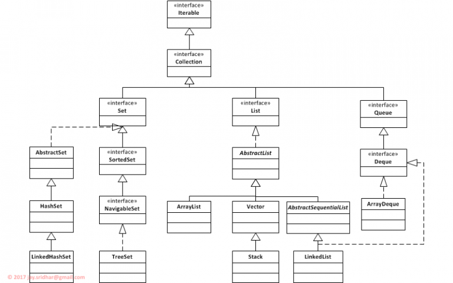

# Java Collections

## Introduction 

A Java collections is a group of objects that are stored together and can be manipulated as a single unit. Java collections are a powerful tool for storing and managing data. The real world use of java collection is manage of database, to implement a search engine etc.

## Why we use java collections?

- To store a large number of objects.
- To store objects that need to be accessed in a specific order.
- To store objects that need to be searched or sorted.
- To share data between different parts of your program.
- To make your code more efficient and maintainable.

## Diagram 

<td align="center"> 
    
</td>

## Types of Java Collections

There are many different types of Java collections, each with its own strengths and weaknesses. Some of the most common types of collections include:

**List:** 
- ArrayList: A dynamically resizable array-based implementation of the List interface.
- LinkedList: A doubly-linked list implementation of the List interface.
- Vector: A synchronized, legacy implementation of the List interface.

**Set:**
- HashSet: An unordered collection that does not allow duplicate elements.
- LinkedHashSet: A HashSet with predictable iteration order based on insertion.
- TreeSet: A sorted set implementation that maintains elements in ascending order.

**Queue:**
- PriorityQueue: A priority-based queue that orders elements based on a priority or comparator.
- LinkedList: Can be used as a queue with methods like offer(), poll(), and peek().

**Map:**
- HashMap: An unordered collection that stores key-value pairs, with quick lookup by key.
- LinkedHashMap: A HashMap with predictable iteration order based on insertion.
- TreeMap: A sorted map implementation that maintains elements based on the natural order of keys or a custom comparator.
Hashtable: A synchronized, legacy implementation of the Map interface.

**Deque:**
- ArrayDeque: A resizable double-ended queue that can function as both a queue and a stack.

**Stack:**
- Stack: A legacy implementation of the stack data structure, with methods like push(), pop(), and peek().

## Conclusion 

* In conclusion, Java collections are a fundamental part of the Java programming language, providing a versatile and efficient way to manage and manipulate data. With a wide range of collection classes and interfaces available, developers can choose the appropriate data structure to suit their specific needs. 

* Java collections offer benefits such as code reusability, flexibility, performance optimization, and type safety through generics. By leveraging Java collections, developers can write cleaner, more modular, and efficient code for handling and processing data in their Java applications.

## References
* [Collections Framework Overview](https://docs.oracle.com/javase/8/docs/technotes/guides/collections/overview.html)
* [Java Collections Tutorial](https://www.tutorialspoint.com/java/java_collections.htm)
* [The Java Collections Framework](https://docs.oracle.com/javase/tutorial/collections/index.html)
* [Effective Java: Programming Language Guide](https://www.amazon.com/Effective-Java-Programming-Language-Edition/dp/0134685990)
* [Collections in Java ](https://www.geeksforgeeks.org/collections-in-java-2/)
